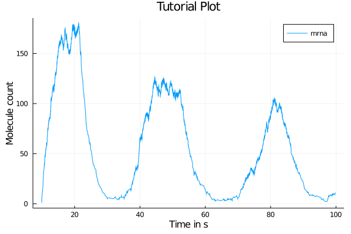

# caitlyn.jl

Code for stochastically simulating oscillatory systems in multicellular models of zebrafish. Current iterations include a stable, tested CPU version written in Julia and an unstable low-level version in CUDA C. Code by Tazmilur Saad.

## Installation 

This package is not available on Julia's registries and must be installed manually. You can clone the repository using:

```
git clone https://github.com/syedtaz/project-cait.git
```

Currently, this package has been tested for Julia 1.5.0 but it should work on the latest releases. Please see this [link](https://github.com/syedtaz/project-cait.git) on how to install Julia. Once installed, you can launch the program by entering the Julia REPL and loading the package using

```
julia> include("src/simulator.jl")
```

This will load all of the functions of the package into the REPL scope. If there are dependencies that are not present on your system Julia's package manager will download and precompile them. 

## Quickstart

The following code will create a 1-cell model with 100 seconds of simulation time using the default reactants and rate parameters.

```
julia> model = nrm(1,100)
```

You can plot this using Plots.jl. For example, the following code snippet will plot the cell contents vs time, using your system's default plotting backend (GTK+ on macOS). If you are running this code on AWS / any other remote environment, you should use the `unicodeplots()` backend.

```
using Plots
plot(model.cells[1].Time, model.cells[1].levels)
```

This is one of the possible outputs.



### Acknowledgements

Thanks to Professor Ahmet Ay for guiding this project.

